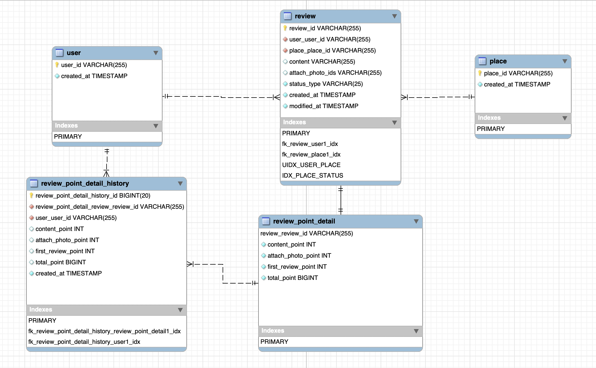
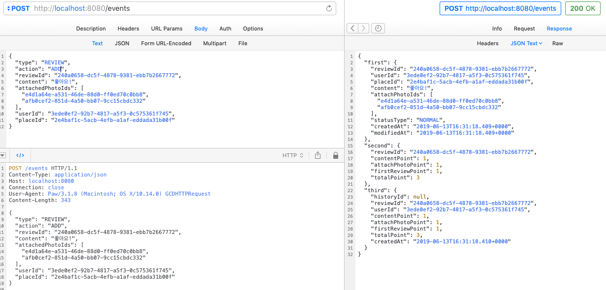
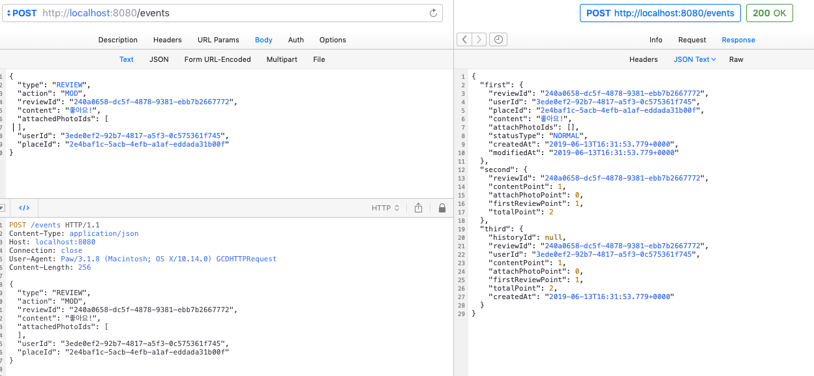
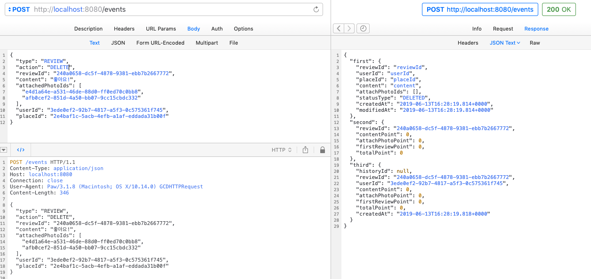
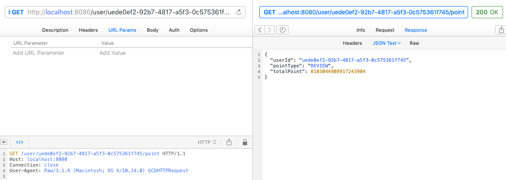
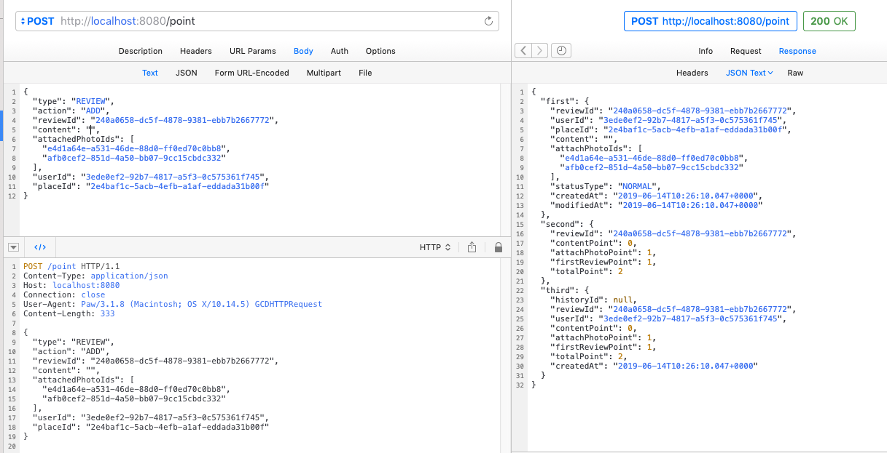

# ERD

## DDL
- https://github.com/hongsgo/triple_point/blob/master/ERD/triple_point_ddl.sql
## TEST scripts
- https://github.com/hongsgo/triple_point/blob/master/ERD/TestScript.sql
# Tests by REST API
## Add
 
## MOD(Removed photos)
 
## DELETE
 
# Check Point API(Total point=Random value)
 
# Save Point API(Empty contents)

 # How to run
 * git clone this repo
 * gradle build
 * docker build -t test .
 * docker run -p8080:8080 test 
 
